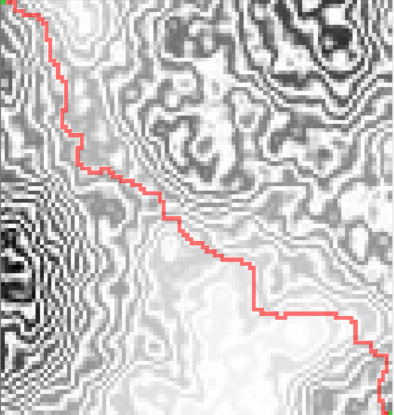
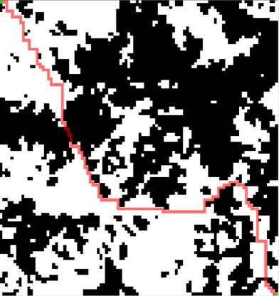
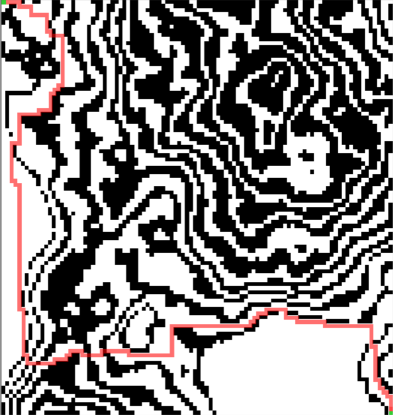
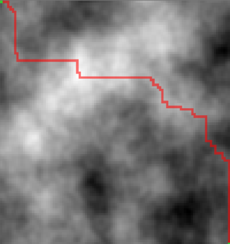
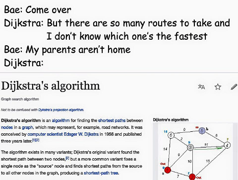

# Dijkstra's Navigation Software

Your task in this project is to solve one of the most famous problems of computer science. The problem is finding the shortest possible route in a _weighted graph_ (a mathematical representation of a terrain map).

You are given multiple input files and your tasks are the following:

### 1. Read and process the input
The test cases are located in the [test_cases](test_cases) folder. Each test case folder contains a file called __input.csv__ that is the textual representation of the graph that you have to work on.

The file that describes the graph. It contains 100 lines of 100 comma-separated numbers. The numbers are either integers or single-precision floating point numbers with a dot as a decimal separator.

The file can be viewed as a matrix of _nodes_ with the column and row numbers as the x and y coordinates respectively. Each number represents the _cost_ of visiting the node (x;y).
Two nodes are considered to be _connected_ if they are either horizontally or vertically next to each other.

For example, the [example input file](example/input.csv) describes the following graph:

### 2. Calculate the cost of the shortest route from the top left corner to the bottom right corner

The cost of a route is the sum of the costs of all the nodes that are in a path from the start leading to the goal. The cost of the start and the goal nodes are included in the cost of the route.

It is recommended that you use _Dijkstra' alogrithm_. 
Do your own research and it is recommended to practice on paper before you try and write any code!

There is a text file in each test case folder called __solution.txt__ which contains the correct cost of the shortest route for the given test case.

The shortest route in the example graph is the following:

If you add the costs of the nodes included in the route, you get the solution of the exercise which should be 12.

### 3. (Optional) Visualize the input and the result using SDL or a similar framework

You should end up with something similar to the __test_case.png__ and the __solution.png__ files that are located in each test case folder.

You can use any language and framework that you are familiar with.

## The test cases

### Test case 1

[input file](test_cases/test_case_1/input.csv)

Solution: 1261.761

### Test case 2

[input file](test_cases/test_case_2/input.csv)

Solution: 451

### Test case 3

[input file](test_cases/test_case_3/input.csv)

Solution: 750

### Test case 4

[input file](test_cases/test_case_4/input.csv)

Solution: 2745.388

Good luck and have fun!

